### 🏠 [Github/spring](https://github.com/swhan9404/spring_lifecare)  :iphone: [Github/Android](https://github.com/swhan9404/android_lifecare)  :page_with_curl:[기능정의서](https://drive.google.com/file/d/1LZsXce04RQRZWH4noepl6sUtd362d0IS/view?usp=sharing) :microphone:[Presentation](https://youtu.be/8FPHJWBBEOk)

# :star: 프로젝트 개요

- 프로젝트명 : Lifecare(신기술을 접목시킨 병원 시스템 구축)
  - spring : 의사 사용자 중심의 진료시스템
  - android : 환자 중심의 편의시스템
- 팀원 : 한승운, 이한림, 진은성, 윤재진, 이건희, 차세웅, 김수정
- 프로젝트 기간 :  2020.09.07 ~ 2020.10.21 ( 6주 )

# :wrench: 프로젝트 구성

# :green_book: Anroid프로젝트 기능

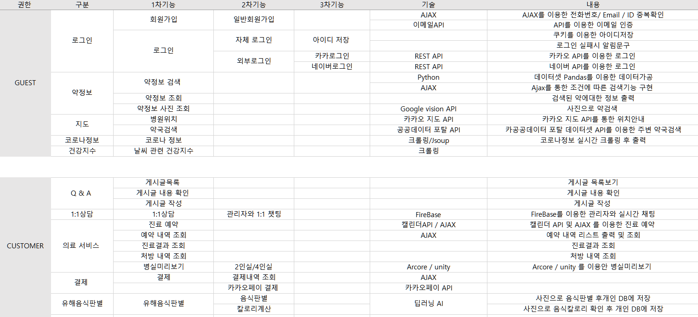

## :hospital:업무 흐름도(안드로이드)

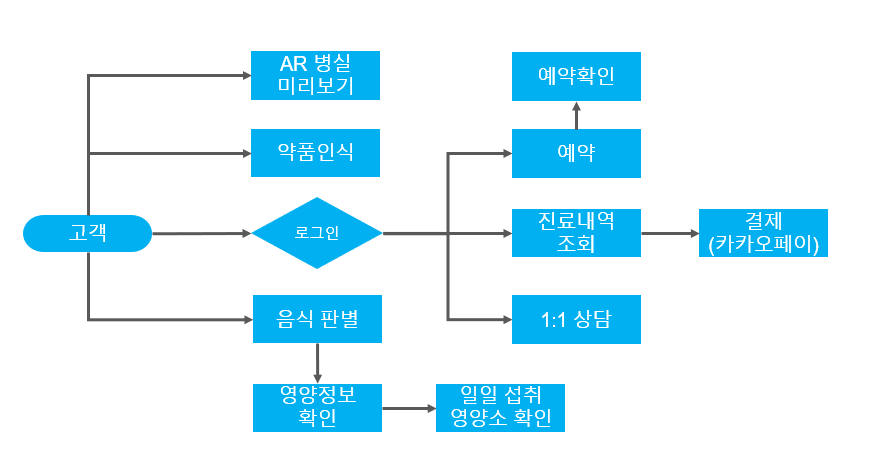

# :mag: overview

## 메인페이지 및 로그인

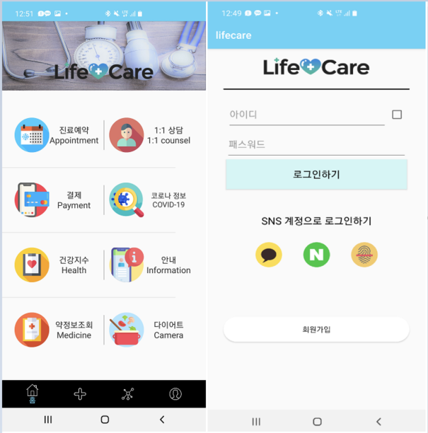

## 환자 예약 및 확인

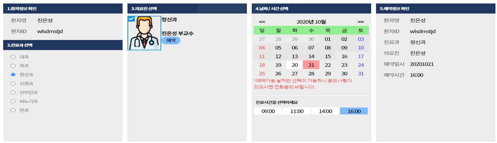

## AR을 이용한 병실 미리보기

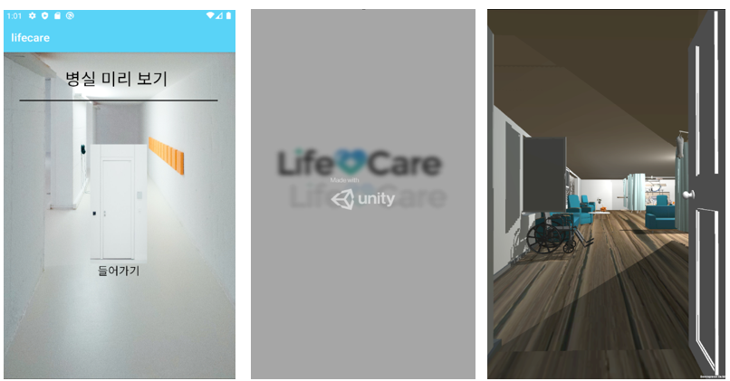

## 음식으로 건강관리

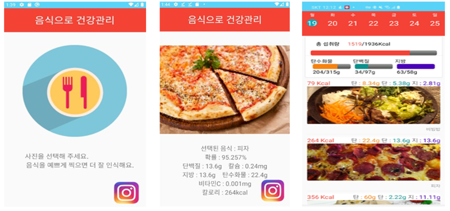

## 의약품검색

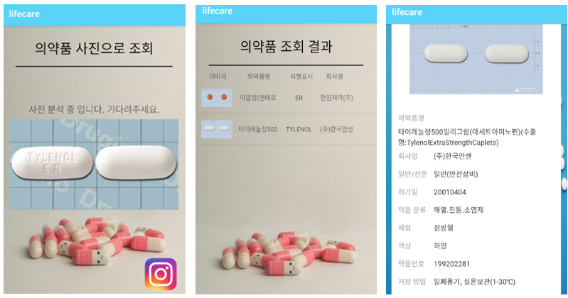

## 실시간 채팅 문의

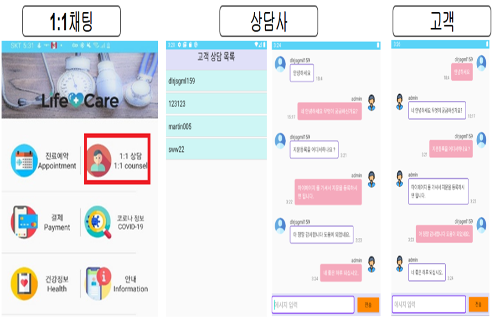

## 카카오페이 결제

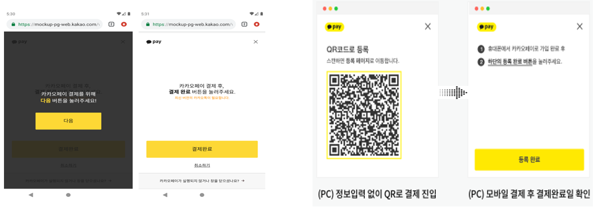

## 주변 약국 검색

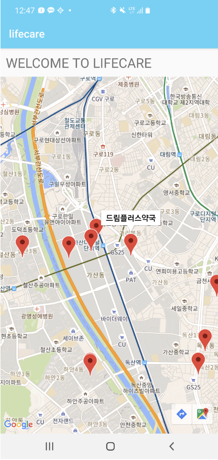

## 실시간 코로나 정보 확인

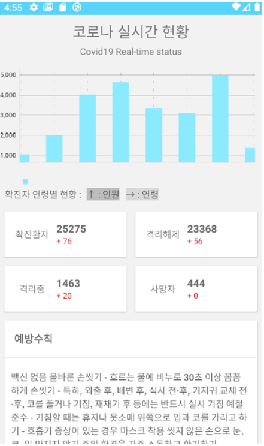

## 건강정보 확인

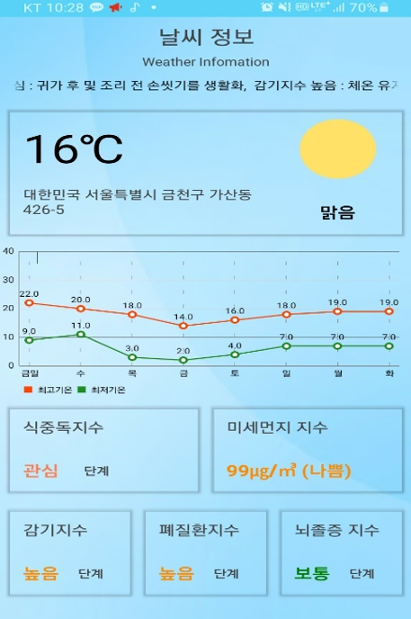

